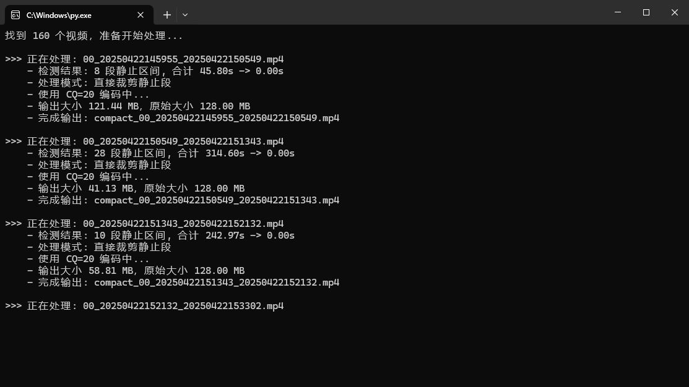

# VideoCompact



用于批量处理小米摄像机导出的 `H.265 / HEVC 4K mp4` 录像。

脚本会扫描 `input` 目录中的所有 `mp4` 文件，识别其中连续静止超过 3 秒的片段，并按规则压缩时间轴后输出到 `output` 目录。

当前默认规则：

- 运动画面保留正常速度
- 静止画面直接从时间线上裁掉
- 输出视频保持 `H.265 / HEVC`
- 输出分辨率不变
- 输出帧率固定为 `20fps`
- 正常速度片段保留音频
- 使用 NVIDIA GPU 进行编码
- 固定使用 `CQ=20`
- 如果处理后文件比原文件更大，则直接复制源文件到 `output`

## 目录结构

```text
VideoCompact/
├─ compact_video.py
├─ ffmpeg.7z
├─ ffprobe.7z
├─ input/
└─ output/
```

解压后应变为：

```text
VideoCompact/
├─ compact_video.py
├─ ffmpeg.7z
├─ ffmpeg.exe
├─ ffprobe.7z
├─ ffprobe.exe
├─ input/
└─ output/
```

## 依赖

当前脚本依赖以下内容：

- `Python 3`
- `ffmpeg.exe`
- `ffprobe.exe`

说明：

- `ffmpeg.exe` 用于静止检测、裁剪拼接、音视频处理、GPU 编码
- `ffprobe.exe` 用于读取视频时长、流信息、码率等元数据

## 下载后先做什么

由于 `ffmpeg.exe` 和 `ffprobe.exe` 文件较大，不方便直接提交到 Git，所以项目中提供的是压缩包：

- `ffmpeg.7z`
- `ffprobe.7z`

下载项目后，第一步先把这两个压缩包解压到项目根目录，解压完成后需要看到：

- `ffmpeg.exe`
- `ffprobe.exe`

如果没有先解压，脚本会因为找不到这两个文件而无法运行。

## 使用方法

1. 下载项目
2. 先把项目根目录中的 `ffmpeg.7z` 和 `ffprobe.7z` 解压
3. 把需要处理的 `mp4` 视频放进 `input` 目录
4. 在项目目录执行：

```powershell
python compact_video.py
```

5. 处理结果会输出到 `output` 目录

## 输出规则

### 1. 正常处理成功

输出文件名格式：

```text
compact_<源文件名>
```

例如：

```text
compact_00_20251205124427_20251205125902.mp4
```

### 2. 如果处理后比原文件更大

脚本不会继续尝试别的 CQ 档位，而是：

- 直接复制 `input` 中的原文件到 `output`
- 文件名仍然是 `compact_<源文件名>`

这样可以保证：

- 输出目录结构统一
- 不会因为重新编码导致文件反而更大

### 3. 如果整个视频都被判定为静止

脚本不会输出视频文件，而是在 `output` 中生成一个标记文件：

```text
compact_<源文件名>.empty
```

例如：

```text
compact_00_20251205124427_20251205125902.mp4.empty
```

这个标记表示该视频整段都是静止内容，所以被直接跳过。

## 当前处理逻辑

### 静止检测

脚本会先做一个仅用于检测的低成本分析：

- 先降到 `5fps`
- 再缩小分辨率
- 再做轻微模糊
- 最后使用 `mpdecimate` 判断静止区间

这一步只用于判断静止与否，不影响最终输出画质。

### 时间轴处理

当前默认模式为：

```python
STATIC_SEGMENT_MODE = "drop"
```

表示：

- 静止段直接裁掉
- 只保留运动段

如果以后想改成“静止段保留，但加速播放”，可以把这个值改成：

```python
STATIC_SEGMENT_MODE = "speedup"
```

## 可调参数

可以在 `compact_video.py` 里修改这些参数：

- `STATIC_SEGMENT_MODE`
  - `"drop"`：直接删除静止段
  - `"speedup"`：静止段倍速保留

- `STATIC_MIN_SECONDS`
  - 连续静止超过多少秒才处理
  - 当前默认：`3.0`

- `STATIC_SPEED`
  - 仅在 `"speedup"` 模式下有效
  - 当前默认：`8.0`

- `OUTPUT_FPS`
  - 输出帧率
  - 当前默认：`20`

- `FIXED_CQ`
  - 固定编码质量
  - 当前默认：`20`

- `ENCODE_PRESET`
  - NVENC 编码预设
  - 当前默认：`p5`

## 注意事项

- 当前脚本主要针对小米摄像机导出的 `4K H.265 mp4` 录像设计
- 重新编码后，不可能在数学意义上做到绝对 `100%` 无损
- 当前策略已经尽量保持：
  - 编码格式不变
  - 分辨率不变
  - 像素格式不变
  - 音频规格尽量保持一致
- 如果你的显卡或驱动不支持 `hevc_nvenc`，脚本会处理失败

## 典型流程

```text
检测静止片段
-> 裁掉静止段
-> 保留运动段音频
-> 拼接结果
-> 用 GPU 编码为 HEVC
-> 如果结果比原文件大，则复制原文件并改名
```

## 文件说明

- `compact_video.py`：主脚本
- `ffmpeg.7z`：`ffmpeg.exe` 压缩包，下载后需先解压
- `ffprobe.7z`：`ffprobe.exe` 压缩包，下载后需先解压
- `input/`：待处理视频目录
- `output/`：输出目录
