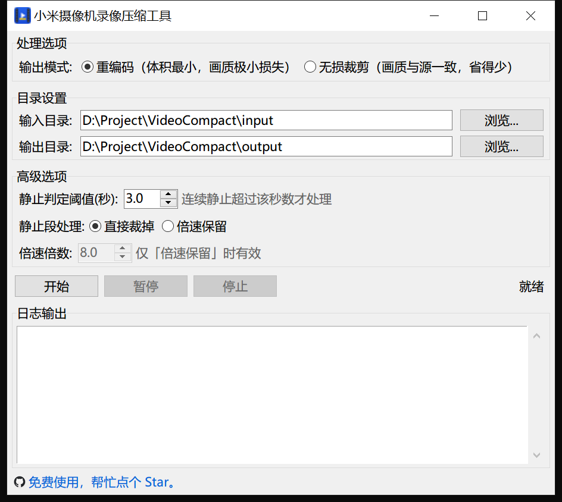

# VideoCompact



[](https://github.com/waf2311/VideoCompact/releases)
[](./LICENSE)


用于批量处理小米摄像机导出的 `H.265 / HEVC 4K mp4` 录像。

软件会扫描 `input` 目录中的所有 `mp4` 文件，识别其中连续静止超过 3 秒的片段，并按规则压缩时间轴后输出到 `output` 目录。

当前默认规则：

- 运动画面保留正常速度
- 静止画面直接从时间线上裁掉
- 提供两种输出模式（`OUTPUT_MODE`）：
  - `reencode`（默认）：重编码，体积最小，画质有极小损失
  - `lossless`：无损裁剪，画质与源 100% 一致，但省得少
- 输出视频保持 `H.265 / HEVC`，分辨率不变
- 输出帧率保持源时间基（`-fps_mode vfr`，不再强制补到固定帧率）
- 正常速度片段保留音频
- 检测优先用 NVIDIA GPU 解码，失败自动回退 CPU
- 如果处理后文件比原文件更大，则直接复制源文件到 `output`

> 本软件只提供图形界面（GUI）一种使用方式，打开后选择目录点击「开始」即可。

### 关于两种输出模式

HEVC 重编码在数学上**一定会有损**，无法做到和源「一模一样」。因此：

- `reencode`：按编码器候选链（`hevc_nvenc` -> `hevc_amf` -> `libx265`）重编码。`CQ=20` 作为画质上限，并叠加「按源文件推算的码率上限」，
  保证输出体积不超过源文件的 `ENCODE_SIZE_RATIO` 倍。可以按秒精确裁剪。
  - `hevc_nvenc` / `libx265` 原生支持「画质 + 码率上限」，一次编码即可收敛体积。
  - `hevc_amf` 的 `cqp` 是固定 QP、不吃码率上限，先用它追求画质；若结果超过源文件体积，
    会自动改用 `vbr_peak`（目标码率按额度打折，画质仍不低于源）重编一次兜底，避免直接回退为复制源文件。
- `lossless`：**完全不重编码**，直接流复制（stream copy）。画质与源 100% 一致、速度极快，
  但只能在关键帧处切；小米摄像机 GOP 固定 **6 秒**，所以静止段只能按 6 秒整数倍删除，
  会有残留静止、省得少（实测约 0~25%）。

## 目录结构

```text
VideoCompact/
├─ src/
│  ├─ gui.py            （图形界面入口）
│  └─ core.py           （核心处理逻辑）
├─ assets/              （图标）
├─ docs/                （README 图片）
├─ input/               （待处理视频目录）
├─ output/              （输出目录）
├─ ffmpeg.7z            （ffmpeg.exe 压缩包，Git LFS 存储）
├─ ffprobe.7z           （ffprobe.exe 压缩包，Git LFS 存储）
├─ VideoCompact.spec    （PyInstaller 打包配置）
├─ build.bat            （一键打包脚本，双击运行）
├─ LICENSE
└─ .github/workflows/   （GitHub Actions 自动发布）
```

运行后会在项目根目录（打包版为 exe 同级）自动生成：

- `detect/`：检测结果缓存目录

## 依赖

- `Python 3`（源码运行 / 打包时需要）
- `ffmpeg.exe`、`ffprobe.exe`（运行时需要，Windows）

说明：

- `ffmpeg.exe` 用于静止检测、裁剪拼接、音视频处理、GPU 编码
- `ffprobe.exe` 用于读取视频时长、流信息、码率等元数据

## 快速开始

### 方式一：直接下载打包版（推荐，免 Python 环境）

1. 打开 [Releases](https://github.com/waf2311/VideoCompact/releases) 下载最新的 `VideoCompact-*-win64.zip`
2. 解压后目录结构如下，双击 `VideoCompact.exe` 即可运行：

```text
VideoCompact/
├─ VideoCompact.exe   外部唯一的 exe，双击运行
├─ bin/               核心依赖（Python 运行时 + ffmpeg.exe + ffprobe.exe + 图标）
├─ input/             默认输入目录（放视频）
└─ output/            默认输出目录
```

打开后默认的输入 / 输出目录就是同级的 `input` / `output`。

> 目标电脑建议有 NVIDIA 或 AMD 显卡与较新的驱动（检测 / 编码优先走 GPU；检测失败自动回退 CPU，编码失败按候选链自动回退，最差用 CPU `libx265` 编码，速度会慢很多）。

### 方式二：从源码运行

仓库内已包含 `ffmpeg.7z` / `ffprobe.7z`，无需另外下载。更多本地开发细节见下方[「本地开发」](#本地开发)。

```powershell
# 1. 安装运行时依赖
python -m pip install pystray pillow

# 2. 解压仓库根目录中的 ffmpeg.7z / ffprobe.7z 到项目根目录
#    解压后需要能看到 ffmpeg.exe 和 ffprobe.exe

# 3. 启动图形界面
python src/gui.py
```

## 使用方法（图形界面）

界面功能：

- 选择输出模式，默认 `重编码`（体积最小），另一个是 `无损裁剪`（画质与源一致）
- 选择输入目录和输出目录；打包版打开时默认就是 exe 同级的 `input` / `output`
- 「高级选项」卡片（仅在「重编码」模式下显示）：
  - 静止判定阈值（秒）
  - 静止段处理方式（直接裁掉 / 倍速保留）与倍速倍数
- 下方实时显示日志输出
- 支持 `暂停` / `继续`（暂停会真正挂起当前 ffmpeg 进程）/ `停止`
- 支持最小化到系统托盘：点击最小化或关闭窗口都会缩进托盘；托盘菜单可显示主界面、暂停、继续、退出

## 打包成 exe（免 Python 环境）

打包后会生成一个自带运行环境的文件夹，复制到其他 Windows 电脑上双击即可运行，无需安装 Python。

1. 先把 `ffmpeg.7z`、`ffprobe.7z` 解压到项目根目录
2. 双击 `build.bat` 即可（也可以在命令行传入 PyPI 镜像地址）：

```bat
:: 默认使用清华镜像
build.bat

:: 使用官方 PyPI
build.bat default

:: 指定镜像地址
build.bat https://mirrors.aliyun.com/pypi/simple/
```

> 脚本结束会停在“按回车键退出”，不会一闪而过。

3. 产物布局如下，把整个 `VideoCompact` 文件夹复制到目标电脑：

```text
dist\VideoCompact\
├─ VideoCompact.exe   外部唯一的 exe，双击运行
├─ bin\               核心依赖（Python 运行时 + ffmpeg.exe + ffprobe.exe + 图标）
├─ input\             默认输入目录（放视频）
└─ output\            默认输出目录
```

4. 双击 `VideoCompact.exe` 运行

说明：

- 打开的 exe 就是 `VideoCompact.exe` 一个文件，所有依赖都在 `bin\` 里，ffmpeg / ffprobe 也可以直接替换
- 打包体积较大（约 450 MB），因为 `bin\` 里包含完整的 ffmpeg / ffprobe
- 打包细节见 `VideoCompact.spec`

## 本地开发

### 环境要求

- Windows 10 / 11
- Python 3.11+
- 推荐 NVIDIA / AMD 显卡 + 较新驱动（检测走 GPU、编码走 NVENC / AMF；检测失败自动回退 CPU，编码失败按候选链自动回退到 CPU `libx265`）

### 拉取与准备

> `ffmpeg.7z` / `ffprobe.7z` 通过 **Git LFS** 存储。克隆前请先安装 [Git LFS](https://git-lfs.com/)
> 并执行一次 `git lfs install`，否则拉下来的只是指针文件（体积很小、无法解压）。

```powershell
# 安装 Git LFS（仅首次需要）
winget install GitHub.GitLFS
git lfs install

# 克隆仓库（LFS 文件会自动拉取）
git clone https://github.com/waf2311/VideoCompact.git
cd VideoCompact

# 解压随仓库提供的 ffmpeg（在根目录得到 ffmpeg.exe / ffprobe.exe）
# 用 7-Zip 解压，例如：
#   & "C:\Program Files\7-Zip\7z.exe" x ffmpeg.7z
#   & "C:\Program Files\7-Zip\7z.exe" x ffprobe.7z

# 创建虚拟环境并安装运行时依赖
python -m venv .venv
.\.venv\Scripts\Activate.ps1
python -m pip install pystray pillow
```

### 运行与调试

```powershell
# 图形界面（唯一入口）
python src/gui.py
```

### 打包

双击 `build.bat` 即可；也可在项目根目录用命令行调用：

```bat
build.bat              :: 默认使用清华镜像
build.bat default      :: 使用官方 PyPI
build.bat <镜像地址>   :: 指定 PyPI 镜像
```

打包依赖 `pyinstaller`、`pystray`、`pillow`，脚本会自动安装；产物见 `dist\VideoCompact\`。

### 代码结构

- `src/gui.py`：Tkinter 界面、系统托盘、暂停 / 停止控制；启动时把界面选项写回 `core` 模块。
- `src/core.py`：静止检测（`mpdecimate`）与编码（NVENC 重编码 / 无损流复制）的全部逻辑。
  - 目录解析：源码态 `BASE_DIR` 为项目根目录、静态资源在 `assets/`；打包态可写目录在 exe 同级、资源在 `_MEIPASS`。
  - 关键配置集中在文件顶部「配置区」，详见[「可调参数」](#可调参数)。
- `VideoCompact.spec`：PyInstaller 配置（入口 `src/gui.py`，运行时依赖打入 `bin\`）。
- `.github/workflows/release.yml`：推送 `v*` tag 时在 `windows-latest` 上自动打包并发布 Release。

### 提交约定

- 不要提交 `ffmpeg.exe` / `ffprobe.exe` / `build/` / `dist/` / `detect/`（已在 `.gitignore` 中忽略）。
- `input/`、`output/` 仅保留 `.gitkeep`，不要提交实际视频。

## 输出规则

### 1. 正常处理成功

输出文件名格式：

```text
compact_<源文件名>
```

例如：

```text
compact_00_20251205124427_20251205125902.mp4
```

### 2. 如果处理后比原文件更大

软件不会继续尝试别的档位，而是：

- 直接复制 `input` 中的原文件到 `output`
- 文件名仍然是 `compact_<源文件名>`

### 3. 如果整个视频都被判定为静止

软件不会输出视频文件，而是在 `output` 中生成一个标记文件：

```text
compact_<源文件名>.empty
```

例如：

```text
compact_00_20251205124427_20251205125902.mp4.empty
```

## 当前处理逻辑

### 静止检测

软件会先做一个仅用于检测的低成本分析：

- 优先用 NVIDIA GPU（NVDEC）硬解，失败则自动回退到 CPU 软解
- 先降到 `5fps`，再缩小分辨率并轻微模糊
- 最后使用 `mpdecimate` 判断静止区间

这一步只用于判断静止与否，不影响最终输出画质。检测结果会缓存到 `detect/` 目录，重复运行不会重复检测。

### 时间轴处理

当前默认模式为：

```python
STATIC_SEGMENT_MODE = "drop"
```

表示静止段直接裁掉、只保留运动段。如果以后想改成“静止段保留，但加速播放”，可以把这个值改成 `"speedup"`。

## 可调参数

可以在 `src/core.py` 里修改这些参数：

- `OUTPUT_MODE`：`"reencode"`（默认）/ `"lossless"`
- `STATIC_SEGMENT_MODE`：`"drop"`（默认）/ `"speedup"`
- `STATIC_MIN_SECONDS`：连续静止超过多少秒才处理，默认 `3.0`
- `STATIC_SPEED`：`"speedup"` 模式下的倍速，默认 `8.0`
- `DETECTION_USE_GPU`：检测阶段是否优先使用 GPU 解码，默认 `True`
- `DETECT_DIR`：检测结果缓存目录，默认项目下的 `detect/`
- `MAX_ENCODE_JOBS`：编码并发数量（NVENC 限流，建议 1-2），默认 `1`
- `FIXED_CQ`：编码画质上限，默认 `20`
- `ENCODE_SIZE_RATIO`：输出体积相对源文件的上限比例，默认 `1.0`
- `ENCODE_MIN_MAXRATE` / `ENCODE_MAX_MAXRATE`：码率上限的下限 / 上限兜底
- `ENCODE_PRESET`：NVENC 编码预设，默认 `p5`
- `ENCODE_CPU_PRESET`：CPU 编码（`libx265`）预设，默认 `fast`
- `ENCODER_CANDIDATES`：编码器候选链，默认 `hevc_nvenc` -> `hevc_amf` -> `libx265`
- `ENCODE_CAPPED_TARGET_RATIO`：AMF 体积兜底时的目标码率折扣，默认 `0.9`

## 注意事项

- 当前软件主要针对小米摄像机导出的 `4K H.265 mp4` 录像设计
- 重新编码后，不可能在数学意义上做到绝对 `100%` 无损
- 当前策略已经尽量保持编码格式、分辨率、像素格式不变，音频规格尽量一致
- 无 NVIDIA / AMD 显卡也可运行，重编码会自动回退到 CPU（`libx265`），速度明显更慢
- 体积能省多少取决于静止段占比：静止画面本身就很省码率，所以「砍静止」主要省的是时长；
  若源本身码率很低（如 2~3 Mbps 的 4K 监控录像）且静止段很少，输出体积会接近源文件大小——
  这是正常现象，强行压小会明显掉画质

## 文件说明

- `src/gui.py`：图形界面入口
- `src/core.py`：核心处理逻辑
- `VideoCompact.spec`：PyInstaller 打包配置
- `build.bat`：一键打包脚本（双击运行，内部调用 PyInstaller）
- `assets/`：应用与托盘图标
- `docs/`：README 图片
- `input/`：待处理视频目录
- `output/`：输出目录
- `detect/`：检测结果缓存目录（运行后自动生成）
- `ffmpeg.7z` / `ffprobe.7z`：`ffmpeg.exe` / `ffprobe.exe` 压缩包（随仓库提供，由 **Git LFS** 存储，源码运行前需先解压到根目录）

## License

[MIT](./LICENSE)
